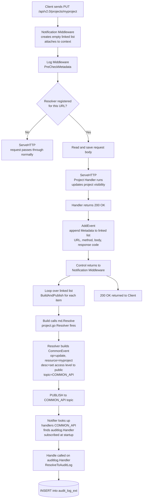

# Braindump for https://github.com/goharbor/harbor/issues/22942

we just need a simple sudit log that this person chaged this project from public -> private or vice versa.

how does this audit logs work:

log middleware runs inside it -> checks if a resolver is registered for that URL (urlResolvers[urlPattern] = resolver) -> if a resolver is registered, it reads and saves the request body now (because by the time the handler runs and sends a response, the request body stream is already consumed) -> calls ServeHTTP so the actual handler runs and responds -> after the handler responds, calls notification.AddEvent(e.Ctx, e, true) which appends one commonevent.Metadata item (URL, method, saved body, response code) onto the linked list via e.Events.PushBack(m) -> log middleware ends

control returns to notification middleware -> it loops over the linked list and calls BuildAndPublish for each item -> BuildAndPublish calls Build which calls md.Resolve(e) -> this is where we write a project.go and a Resolve() , that will be called -> it will build CommonEvent struct (operation, resourceType, resourceName, operationDescription) and sets evt.Topic = "COMMON_API" -> then we publish notifier.

Publish(ctx, "COMMON_API", commonEvent) is called - this sends the CommonEvent message onto the "COMMON_API" topic -> the notifier looks up handlers["COMMON_API"] which was populated at startup when notifier.Subscribe(event.TopicCommonEvent, &auditlog.Handler{}) ran and stored &auditlog.Handler{} against the "COMMON_API" topic -> because auditlog.Handler was subscribed to "COMMON_API", the notifier calls Handle() on it — this is the subscriber receiving the published message -> Handle receives the CommonEvent, calls ResolveToAuditLog() on it, and writes the row to the audit_log_ext table

